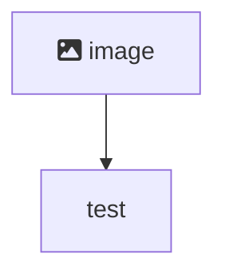

# Front End

## Setup

### font-awesome

```
npm i --save @fortawesome/fontawesome-svg-core
```

```
# Free icons styles
npm i --save @fortawesome/free-solid-svg-icons
npm i --save @fortawesome/free-regular-svg-icons

```

```
npm i --save @fortawesome/react-fontawesome@latest
```


